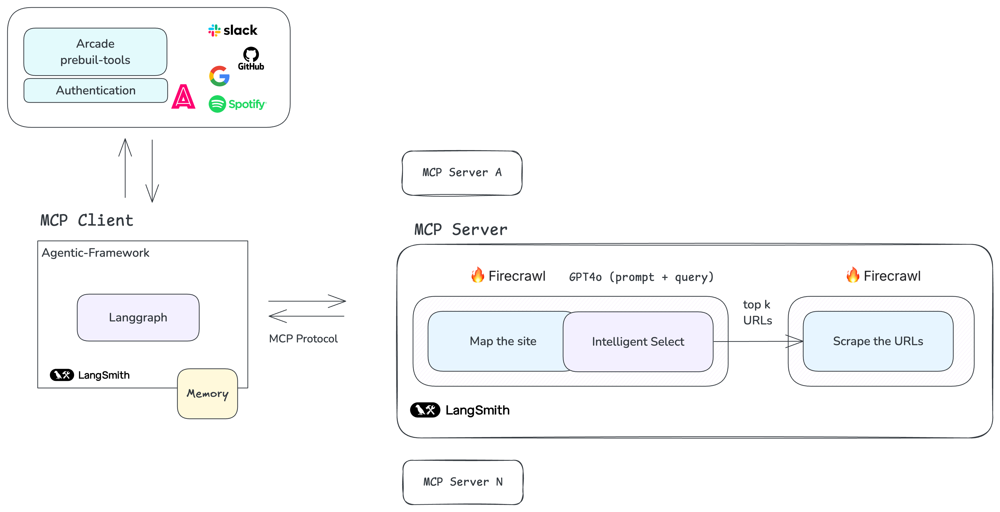

An application built on the Model Context Protocol (MCP) that transforms any website into highly relevant content based on your queries. The app seamlessly integrates with platforms like X, Slack, and others through Arcade.

###Perfect For:
- LLM-Ready File Creation: Generate .txt files optimized for use with large language models.
- Documentation Indexing: Organize and structure documentation effortlessly.
- Research Automation: Save time by automating repetitive research tasks.

### Tech Stack:
- LangGraph as the MCP Client
- Firecrawll for web research (site mapping, intelligent selection, and scraping)
- Arcade for seamless platform integration (X, Slack, etc.)
- Tracing powered by LangChainAI LangSmith
- Utilizes OpenAI's structured outputs, async processing, exponential backoff, and Pydantic for reliability

### Architecture Diagram

