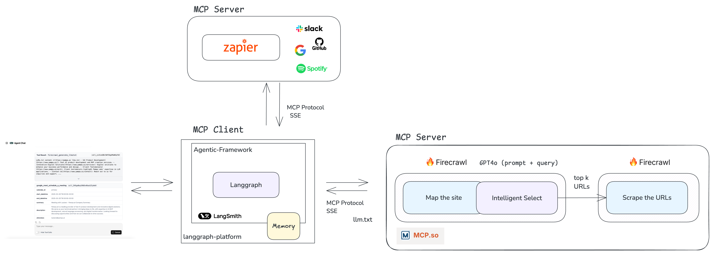

# Researcher Agent

An application built on the Model Context Protocol (MCP) that transforms any website into highly relevant content based on your research needs. Seamlessly integrates with platforms like X, Slack, and others through Zapier.

## Technical Overview

### Tech Stack
- Frontend: [LangChain Agent Chat UI](https://github.com/langchain-ai/agent-chat-ui)
- Backend: 
  - LangGraph as the MCP Client, deployed on Langraph Platform
  - React Agent: Custom integration with MCP adapters
  - Research Engine: Firecrawl for intelligent web scraping and LLM-Ready file generation
  - Integration Layer: Zapier for cross-platform connectivity (X, Slack, etc.)

### Architecture Diagram

