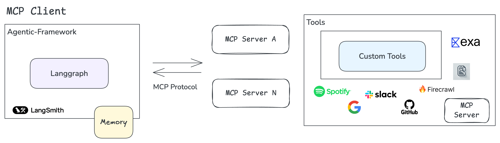

# LangGraph MCP Integration

This repository demonstrates the integration of LangGraph with MCP servers. This integration allows you to build powerful agent-based applications that can interact with both MCP servers and external services.

## Features

- Seamless integration of LangGraph with MCP servers
- Support for React-based agents using MCP tools
- Integration with Arcade and custom services (like Firecrawl)
- Asynchronous tool execution
- Type-safe tool wrapping with Pydantic models

Make sure to set up your environment variables in a `.env` file:

```env
OPENAI_API_KEY=your_openai_api_key
ARCADE_API_KEY=your_arcade_api_key
ARCADE_USER_ID=your_arcade_user_id
```

### Development Commands

```bash
 uv run agents/base/react.py
```

## Architecture



### Components

1. **LangGraph Agent**
   - React Agent: Implements the ReAct pattern for reasoning and action
   - LangGraph MCP Client: Bridges LangGraph with MCP servers

2. **MCP Servers**
   - Firecrawl Server: Provides web crawling capabilities

3. **Arcade Server**: Offers integration with various services, its so familiar with MCP.

## Usage

### Basic LangGraph MCP Client

The `LanggraphMCPClient` class provides a bridge between LangGraph and MCP servers:

```python
from clients.langgraph.client import LanggraphMCPClient
from mcp import StdioServerParameters

# Configure your MCP server
server_params = StdioServerParameters(
    command="uv",
    args=[
        "--directory",
        "/path/to/your/service",
        "run",
        "website-firecrawl-service"
    ]
)

# Use the client to get tools from the MCP server
async with LanggraphMCPClient(server_params=server_params) as mcp_client:
    tools = await mcp_client.get_tools()
```

### Creating a React Agent with MCP Tools

Here's an example of creating a React agent that combines MCP tools with Arcade services:

```python
from langchain_core.messages import HumanMessage
from langchain_openai import ChatOpenAI
from langgraph.prebuilt import create_react_agent
from langchain_arcade import ArcadeToolManager

async def create_agent():
    tools = []
    
    # Get tools from MCP server
    async with LanggraphMCPClient(server_params=server_params) as mcp_client:
        tools.extend(await mcp_client.get_tools())
    
    # Add Arcade tools
    tool_arcade_manager = ArcadeToolManager(api_key=os.getenv("ARCADE_API_KEY"))
    tools.extend(tool_arcade_manager.get_tools(toolkits=["slack"]))
    
    # Create the agent with combined tools
    model = ChatOpenAI(model="gpt-4")
    graph = create_react_agent(model, tools=tools)
    
    return graph

# Use the agent
inputs = {
    "messages": [HumanMessage(content="Analyze pampa.ai and send a summary to Slack")],
}

config = {
    "configurable": {
        "thread_id": "1",
        "user_id": os.getenv("ARCADE_USER_ID"),
    }
}

result = await graph.ainvoke(inputs, config=config)
```

### Using the Firecrawl Service

The Firecrawl service is implemented as an MCP server, allowing your agents to crawl and analyze websites:

```python
# Example configuration in your MCP server setup:
server_params = StdioServerParameters(
    command="uv",
    args=[
        "--directory",
        "/path/to/firecrawl",
        "run",
        "website-firecrawl-service"
    ]
)

# The Firecrawl service tools become available through the MCP client
# Example usage in your agent's prompt:
"Analyze the website example.com and provide a summary"
```

## Resources

- [MCP Official Documentation](https://modelcontextprotocol.io/docs)
- [MCP GitHub Repository](https://github.com/modelcontextprotocol)
- [LangGraph Documentation](https://python.langchain.com/docs/langgraph)

