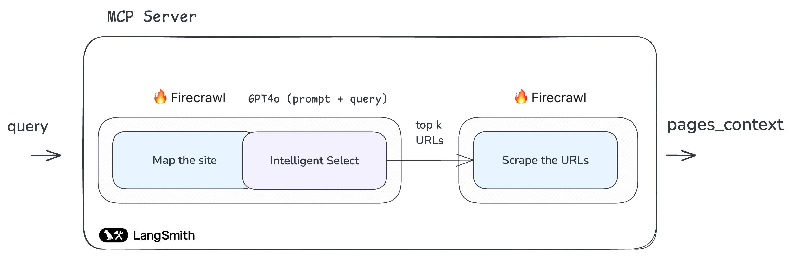

# website_firecrawl_service - MCP Server

🔍 Internet research just got smarter! Built an MCP server that turns any website into structured, relevant content based on your queries!

Using @Firecrawl's powerful features (mapping, selection, scraping), combined with GPT-4o for smart URL filtering, it's like having an AI research assistant that knows exactly what you're looking for! Works seamlessly with Claude, or any MCP-compatible client!



*An agentic web scraping system powered by Firecrawl: Map → Select → Scrape → Extract*

---

## Features

- **Efficient Web Crawling**: Crawls websites using the Firecrawl API with customizable link limits and intelligent URL selection
- **Intelligent URL Selection**: Uses GPT-4 to select the most relevant URLs based on user queries
- **Smart Content Processing**: Extracts and cleans HTML content, providing readable text output

## Setup

1. Create a `.env` file with the following required environment variables:
   ```
   FIRECRAWL_API_KEY=your_firecrawl_api_key
   OPENAI_API_KEY=your_openai_api_key
   ```

## Usage

The server exposes a single tool:

### website_firecrawl

**Description**: Crawls a website and returns relevant content based on a query.

**Parameters**:
- `query` (string): The search query to filter relevant content
- `base_url` (string): The target website URL to crawl
- `max_links` (integer, optional): Maximum number of links to process (default: 100)

## Technical Details

- Built using the MCP (Model Control Protocol) server framework
- Implements retry logic with exponential backoff for API calls
- Integrates with LangSmith for tracing and monitoring
- Implements singleton patterns for API clients to manage resources efficiently
- Uses Pydantic for robust data validation and serialization:
  - `WebsiteCrawlArgs`: Validates input parameters for the crawling service
  - `CrawlerModel`: Handles URL selection and justification
  - `Page`: Structures metadata and content from crawled pages
- Structured OpenAI Integration:
  - Uses OpenAI's beta chat completions with parsing
  - Automatically validates and converts JSON responses to Pydantic models
  - Ensures type safety and data validation for AI-generated content
- Jinja2 Template System:
  - Modular prompt management using template inheritance
  - Dynamic prompt generation based on user queries and context
  - Separate system and user prompt templates for clear separation of concerns
  - Easy maintenance and updates of prompt structures

